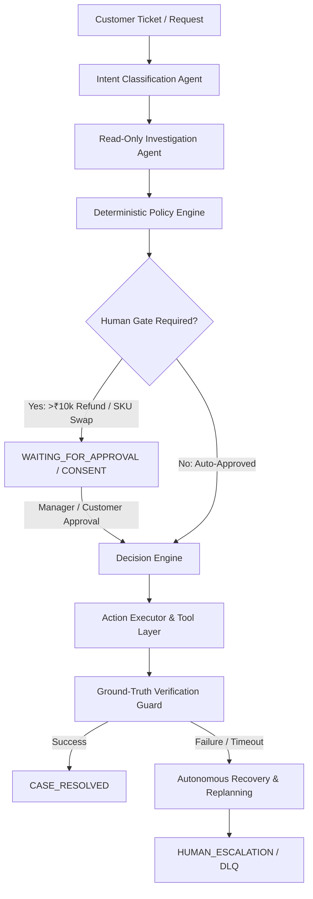

# 🚀 ResolveX — Autonomous Customer Resolution System

> **Production-Grade, Multi-Tenant Autonomous Customer Resolution Agent Platform with Hard Safety Invariants, Ground-Truth Reconciliation, Enterprise RBAC, and Real-Time SRE Observability.**

[](#certification--verification-status)
[](#certification--verification-status)
[-blue.svg)](#certification--verification-status)
[](#license)

---

## 📖 Overview

**ResolveX** is an enterprise-grade autonomous customer support and resolution platform. It combines LLM-driven intelligence with **strict, deterministic safety controls** to automate support tickets (refunds, order replacements, cancellations, inventory queries) while preventing false resolutions, duplicate financial mutations, and security bypasses.

---

## 🛠️ Technology Stack & Dependencies

### **Core & Backend**
- **Runtime & Language**: Node.js, TypeScript 5.5
- **Web Framework**: Express.js (REST APIs, Middlewares, SSE Telemetry)
- **Database & ORM**: SQLite (Development/Test), PostgreSQL (Production), Prisma ORM 6.4
- **Execution & Orchestration**: Custom Durable Work Queue with Monotonic Lease Fencing & Idempotency Engine

### **AI & Machine Learning**
- **Local Model Provider**: Ollama (Llama 3.2 3B / Llama 3 8B)
- **Cloud Model Provider**: OpenAI API (GPT-4o, GPT-3.5-Turbo)
- **AI Safety & Router**: Adaptive Model Router with Cost Optimization, Token Governance, Prompt Injection Defense, and Circuit Breaker

### **Frontend & UI**
- **Framework**: React 18, Vite 5
- **Styling**: Vanilla CSS (Custom Glassmorphism Design System, Responsive Layouts)
- **Icons**: Lucide React

### **Testing & Quality Assurance**
- **Test Runner**: Vitest 1.6
- **Evaluation Harness**: Custom 50-Case Golden Evaluation Dataset & Replay Engine

---

## 🏗️ System Architecture

$$\text{TICKET / GOAL} \rightarrow \text{INTENT} \rightarrow \text{INVESTIGATION} \rightarrow \text{POLICY EVAL} \rightarrow \text{DECISION} \rightarrow \text{ACTION EXECUTOR} \rightarrow \text{VERIFICATION} \rightarrow \text{RECOVERY} \rightarrow \text{RESOLUTION}$$



---

## 🛡️ Hard Safety Invariants & Security Guarantees

ResolveX enforces non-bypassable, deterministic safety controls across every workflow:

1. **Zero False Resolutions**: Cases are marked `RESOLVED` only after double-verified ground-truth confirmation from backend database ledgers.
2. **High-Value Refund Approval Gate**: Refunds exceeding ₹10,000 strictly halt at `WAITING_FOR_APPROVAL` with zero DB mutations until explicit signed manager approval.
3. **Customer Substitution Consent Gate**: SKU replacement or out-of-stock substitutions require explicit customer consent (`WAITING_FOR_CUSTOMER_CONSENT`).
4. **Zero Duplicate Financial Mutations**: Idempotency keys (`resume-{runId}`, `act-{runId}`) guarantee financial transactions execute exactly once even under network crashes.
5. **Monotonic Worker Lease Fencing**: Distributed workers maintain lease generation counters; crashed or stale workers attempting late commits are fenced out.
6. **Adversarial Prompt Injection Defense**: Real-time regex and token guardrails block prompt injection attempts, system override prompts, and SQL injection payloads.
7. **Advisory-Only AI Authority**: The AI model serves exclusively in an advisory capacity (`ADVISORY_ONLY`); it cannot alter system policies, bypass approval gates, or execute raw database queries.

---

## 🚀 Quick Start Guide

### 1. Prerequisites
- **Node.js**: `v20.x` or higher
- **npm**: `v10.x` or higher

### 2. Installation
```bash
git clone <repository-url>
cd Project-1
npm install
```

### 3. Database Initialization & Seed
```bash
npx prisma db push
npm run db:seed
```

### 4. Running Development Servers
To launch both the **Backend API** and the **Frontend Web Dashboard** simultaneously:
```bash
npm run dev
```

- 🟢 **Frontend Dashboard**: [http://localhost:5173](http://localhost:5173)
- ⚙️ **Backend API**: [http://localhost:5000](http://localhost:5000)

---

## 🧪 Testing & Verification

### Run Full Workspace Test Suite (1,611 Tests)
```bash
npm test
```

### Run AI Golden Evaluation Benchmark (50 Production Cases)
```bash
npm run evaluate
```

### Run Live Scenario Demonstrations (A–J)
```bash
npx tsx scratch/run_final_certification_demos.ts
```

### Build Production Artifacts
```bash
npm run build
```

---

## 📊 Certification & Verification Status

| Metric / Gateway | Target | Result | Status |
| :--- | :--- | :--- | :--- |
| **Dedicated Step 10 Certification Suite** | 215 / 215 Tests | **215 / 215 Passed (100%)** | ✅ **PASS** |
| **Full Workspace Test Suite** | 1,611 / 1,611 Tests | **1,611 / 1,611 Passed (37 Files)** | ✅ **PASS** |
| **Skipped / Focused Annotations** | 0 `.skip` / 0 `.only` | **0 `.skip` / 0 `.only`** | ✅ **PASS** |
| **Golden Evaluation Accuracy** | 100% | **50 / 50 Cases Passed (100%)** | ✅ **PASS** |
| **Safety Invariants Score** | 0 Safety Violations | **0 False Resolutions, 0 Approval Bypasses, 0 Duplicate Mutations** | ✅ **PASS** |
| **Production Build (`npm run build`)** | 0 Compilation Errors | **Clean Backend (`tsc`) & Frontend (`vite`) Build** | ✅ **PASS** |

```text
STEP 10 CERTIFIED — FINAL PRODUCTION CERTIFICATION & LAUNCH READINESS VERIFIED
RELEASE STATUS: READY FOR CONTROLLED PRODUCTION DEPLOYMENT — EXTERNAL PRODUCTION CONNECTIVITY STILL REQUIRED
```

---

## 📄 Release & Operational Documentation

For detailed architectural specs, security threat models, and SRE runbooks, refer to the [docs/](file:///c:/Users/Devender/OneDrive/Documents/Project-1/docs) directory:
- 🏛️ [FINAL_ARCHITECTURE_CERTIFICATION.md](file:///c:/Users/Devender/OneDrive/Documents/Project-1/docs/FINAL_ARCHITECTURE_CERTIFICATION.md)
- 🔒 [FINAL_SECURITY_CERTIFICATION.md](file:///c:/Users/Devender/OneDrive/Documents/Project-1/docs/FINAL_SECURITY_CERTIFICATION.md)
- 🚀 [FINAL_DEPLOYMENT_RUNBOOK.md](file:///c:/Users/Devender/OneDrive/Documents/Project-1/docs/FINAL_DEPLOYMENT_RUNBOOK.md)
- 🛠️ [FINAL_OPERATIONS_RUNBOOK.md](file:///c:/Users/Devender/OneDrive/Documents/Project-1/docs/FINAL_OPERATIONS_RUNBOOK.md)
- ✅ [FINAL_RELEASE_CHECKLIST.md](file:///c:/Users/Devender/OneDrive/Documents/Project-1/docs/FINAL_RELEASE_CHECKLIST.md)

---

## 📜 License

MIT License. Developed for enterprise-grade autonomous customer resolution.
