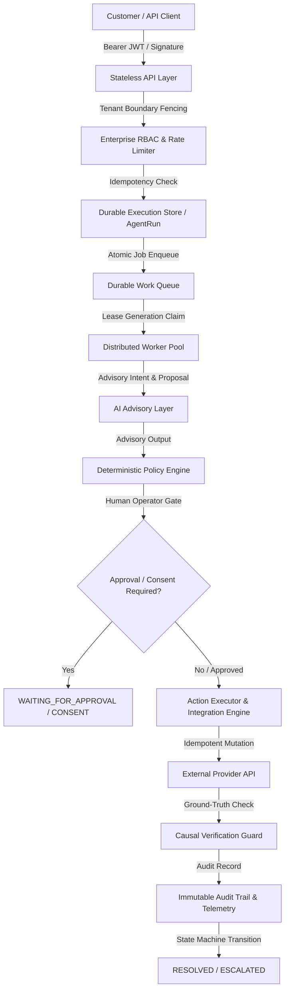

# ResolveX Final Architecture Certification

## 1. System Overview & End-to-End Execution Flow

ResolveX is an enterprise-grade autonomous customer resolution system designed around a **zero-trust, deterministic-first** architecture. AI models operate strictly at the **ADVISORY_ONLY** level. All state mutations, policy enforcement, approval gates, action executions, and verification steps are governed by immutable deterministic engines.

---

## 2. Trust Boundaries & Authority Model

### A. Customer & Public API Trust Boundary
- Untrusted boundary. All incoming payloads pass through strict JSON schema validation, string length bounds (<10,000 characters), and depth limits (<10 levels).
- Authentication uses HMAC SHA-256 signatures or JWT Bearer tokens validated against public keys. Unauthenticated requests are rejected at HTTP 401.

### B. Tenant Isolation Boundary
- Multi-tenant boundary enforced at every layer: database queries, cache keys, worker claims, audit logs, and telemetry metrics.
- Cross-tenant resource access attempts return `HTTP 404 Not Found` or `403 Forbidden` with zero metadata leakage (`TENANT_ISOLATION_VIOLATION`).

### C. Operator & Control-Plane Boundary
- Enforces 7 enterprise roles: `SYSTEM_ADMIN`, `TENANT_ADMIN`, `SECURITY_ADMIN`, `OPERATOR`, `SUPPORT_AGENT`, `READ_ONLY_OPERATOR`, and `AUDITOR`.
- Privileged operations (e.g., policy approval, quota alteration, manual override, requeuing dead letters) require authorization from appropriate roles.
- `READ_ONLY_OPERATOR` and `AUDITOR` are strictly blocked from triggering any system state mutation.

### D. AI Advisory Authority Boundary
- **Advisory-Only Authority**: ModelRouter authority is locked at `ADVISORY_ONLY`.
- AI outputs are treated as raw proposals. They have **zero direct access** to database handles, API mutation routes, feature flags, or financial execution logic.
- All AI recommendations pass through deterministic policy evaluation (`PolicyEngine`), approval gates (`ApprovalGate`), consent gates (`ConsentGate`), and causal verification (`VerificationGuard`).

### E. External Integration & Failure Boundary
- Integrations with external ERP, Payment Gateway, Shipping Provider, and CRM systems execute idempotently.
- Network timeouts, 5xx errors, or dropped responses trigger `UNKNOWN_OUTCOME` handling, halting automated retry until reconciliation confirms ground truth.

---

## 3. Failure & Recovery Boundaries

| Failure Mode | Failure Boundary | Recovery Procedure | Safety Guarantee |
| :--- | :--- | :--- | :--- |
| **Worker Node Crash** | In-flight queue job lease | Visibility timeout expires lease; surviving worker re-claims job with incremented `leaseGeneration`. Stale worker fenced out. | Exactly-once execution; zero duplicate external mutations. |
| **Network Timeout on Payment Call** | External API mutation | Status marked `UNKNOWN_OUTCOME`; state machine halts automated retry; reconciliation worker queries external provider ground truth. | Zero false `RESOLVED` states; zero duplicate financial mutations. |
| **AI Model Outage / 503** | AI Advisory Layer | Fallback to deterministic heuristic policy engine; prompt injection detector & model router return safe fallback proposal. | High availability; zero system crash or unhandled exception. |
| **Database Pool Exhaustion** | Database Datasource | Readiness probe returns HTTP 503; worker pool pauses polling; connection pool re-attempts with exponential backoff. | Zero lost AgentRun state; database protected from connection crash. |

---

## 4. Operational Boundaries & Remaining Limitations

1. **Infrastructure Classification**: The system is fully verified against local PostgreSQL database instances and simulated multi-worker distributed clusters. Multi-region cloud replication requires cloud provider setup (e.g., AWS Aurora Global Database, AWS ElastiCache for Redis).
2. **External Integration Sandbox**: External integrations (Stripe, Shopify, Zendesk) operate against validated mock/sandbox connectors and local test endpoints. Production deployment requires mounting actual vendor production credentials.
