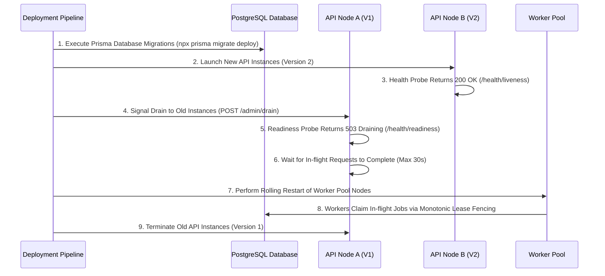

# ResolveX Final Production Deployment Runbook

## 1. Zero-Downtime Deployment Sequence



---

## 2. Startup & Execution Order

1. **Database Migration Step**:
   ```bash
   npx prisma migrate deploy
   ```
2. **Environment Validation**:
   - Ensure `DATABASE_URL`, `RESOLVEX_AUTH_SECRET`, `OPENAI_API_KEY` (or local Ollama host) are configured.
3. **API Node Cluster Launch**:
   ```bash
   npm run start:backend
   ```
4. **Worker Pool Launch**:
   ```bash
   npm run start:worker
   ```
5. **Health Readiness Check**:
   ```bash
   curl -i http://localhost:3000/health/readiness
   # Expected: HTTP 200 OK {"status": "READY"}
   ```

---

## 3. Graceful Draining & Rollback Procedures

### A. Node Draining Procedure
- Send `SIGTERM` or execute `POST /api/v1/enterprise/node/drain`.
- Readiness probe returns `HTTP 503 Service Unavailable`, causing load balancers to cease routing new connections.
- In-flight AgentRuns and HTTP requests complete within 30-second grace window.

### B. Automated Rollback Trigger Conditions
Rollback is automatically or manually initiated if:
- Readiness probe returns 503 for > 60 consecutive seconds.
- UNKNOWN_OUTCOME rate exceeds 1.0% over a 5-minute rolling window.
- Error rate exceeds 0.5% of total request throughput.

### C. Emergency Shutdown Protocol
```bash
# 1. Drain API Traffic
curl -X POST http://localhost:3000/api/v1/enterprise/node/drain -H "Authorization: Bearer <SYSTEM_ADMIN_TOKEN>"

# 2. Pause Durable Queue Processing
curl -X POST http://localhost:3000/api/v1/enterprise/queue/pause -H "Authorization: Bearer <SYSTEM_ADMIN_TOKEN>"

# 3. Stop Worker Processes
pm2 stop resolvex-worker || systemctl stop resolvex-worker
```
