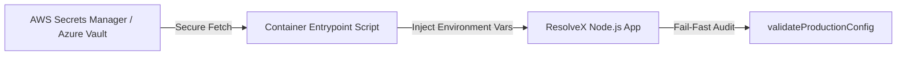

# ResolveX — Production Secrets Management Specification

This document details the secret architecture, provider integration, rotation procedures, and redaction safeguards for ResolveX.

---

## 🔑 Secret Categories & Inventory

| Secret Category | Variable Name | Rotation Cycle | Impact of Compromise | Injection Mechanism |
| :--- | :--- | :--- | :--- | :--- |
| **Authentication Secret** | `RESOLVEX_AUTH_SECRET` | 90 Days | High (JWT signature forgery) | Cloud Secrets Manager -> Environment Variable |
| **Database Credentials** | `DATABASE_URL` | 90 Days | Critical (Unauthorized DB access) | Cloud Secrets Manager -> Environment Variable |
| **AI Provider Keys** | `OPENAI_API_KEY` | 90 Days | Medium (Financial token overuse) | Cloud Secrets Manager -> Environment Variable |
| **Integration API Keys** | `STRIPE_SECRET_KEY`, `TWILIO_AUTH_TOKEN` | 180 Days | High (Unauthorized payment / SMS actions) | Cloud Secrets Manager -> Environment Variable |

---

## ☁️ Provider Integration Architecture

Production instances must fetch secrets from a managed Cloud Secrets Manager at runtime or container startup:

---

## 🚨 Emergency Secret Rotation Procedure

In the event of an emergency credential leak:

1. **Rotate Target Credential**: Generate a new secret in the primary provider (e.g. Stripe Dashboard / AWS Secrets Manager).
2. **Update Cloud Secrets Manager**: Update the secret payload in AWS Secrets Manager / Azure Key Vault.
3. **Trigger Rolling Pod Restart**: Issue a rolling restart to backend pods to load updated secrets without downtime.
4. **Invalidate Stale JWT Tokens**: Update `RESOLVEX_AUTH_SECRET` to invalidate all active session tokens.
