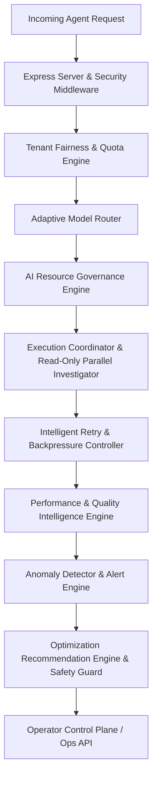

# Step 8 — Repository & Architecture Audit: Advanced Production Intelligence, Optimization & Adaptive Operations

## Executive Summary
This architectural audit inspects the existing ResolveX Autonomous Agent Engine (Steps 1–7) and defines the architectural design, integration boundaries, and deterministic safety controls for **Step 8: Production Intelligence, Performance Optimization & Adaptive Operations**.

The overarching principle governing Step 8 is:
> **AI may recommend optimization, but deterministic systems control execution.**

---

## 1. Existing System Audit (Steps 1–7 Overview)

| Layer / Module | Implementation Location | Current Capabilities | Step 8 Extension Strategy |
| :--- | :--- | :--- | :--- |
| **Database & Ground Truth** | `src/db/` (`client.ts`, `repositories/`) | SQLite / PostgreSQL via Prisma, atomic transactions, `AgentRun`, `AgentTrace`, `ActionRecord`, `VerificationRecord`, ground-truth reconciliation post-crash. | Add DB query latency tracking, connection pool pressure metrics, and query index validation without isolating transaction boundaries. |
| **Integrations & Circuit Breakers** | `src/integrations/` | Typed integrations (Stripe, Logistics, Inventory), `CircuitBreaker` (`CLOSED`, `OPEN`, `HALF_OPEN`), retry loops. | Extend with failure classification (transient vs permanent), retry budget tracking, and adaptive backpressure delay. |
| **AI / LLM Layer & Guardrails** | `src/ai/` (`AIService.ts`, `providers/`) | Local Llama 3.2 (Ollama), OpenAI fallback, prompt injection detection, JSON schema validation. | Add AI Resource Governance (token/cost tracking, budget limits, graceful fallback) and Advisory Adaptive Model Router. |
| **Execution Engine & Fencing** | `src/execution/` (`executionCoordinator.ts`) | Multi-worker queue dispatcher, atomic fencing (`leaseGeneration`), heartbeat, process restart recovery. | Add queue depth monitoring, worker utilization percentiles, and tenant-aware resource fairness & quota limits. |
| **Observability & Alerting** | `src/observability/` (`metricsRegistry.ts`, `slo.ts`, `alertEngine.ts`, `incidentManager.ts`) | Prometheus exporter (`/metrics`), SLO Engine (Availability, Latency, Accuracy), Alert Engine, Incident Manager. | Extend into Production Performance Intelligence Engine (p50/p90/p95/p99 latency breakdown), Anomaly Detector, and Quality Intelligence. |
| **Security & Control Plane** | `src/auth/`, `src/security/`, `src/backend/server.ts` | JWT Auth, RBAC (`OPERATOR`, `READ_ONLY_OPERATOR`, `ADMIN`), Zero-Trust Tenant Isolation, Emergency Kill Switch, Readiness Drain. | Extend Control Plane with Optimization Views, Recommendation Lifecycle (`PROPOSED` -> `APPLIED`), and Experiment Canary/Rollback safety. |

---

## 2. Identified Performance Bottlenecks & Optimization Opportunities

1. **Sequential Investigation Overhead**: Currently, intent classification, order lookup, payment check, and inventory check run sequentially.
   - *Optimization*: Execute independent `READ_ONLY` investigation tool calls concurrently while strictly preserving causal ordering (`MUTATION` -> `VERIFICATION`, `APPROVAL` -> `MUTATION`).
2. **AI Inference Latency & Unbounded Token Cost**: Routing all requests to a single model regardless of task complexity risks latency spikes and cost inflation.
   - *Optimization*: Adaptive Model Router selects cheap/fast local model for simple classifications, reserving stronger models for complex ambiguity, backed by hard token/cost budget limits per run and per tenant.
3. **Transient Retry Storms**: Retrying non-transient errors (e.g. policy block or validation error) wastes worker threads and downstream API capacity.
   - *Optimization*: Failure classification engine ensures ONLY `transient` network/timeout errors receive retries with exponential backoff, jitter, and backpressure.
4. **Noisy Tenant Starvation**: A tenant firing rapid batch webhooks can consume all execution coordinator workers.
   - *Optimization*: Tenant fairness controller enforces per-tenant active concurrency limits and queue quotas.

---

## 3. Deterministic Safety Boundaries (Non-Negotiable Invariants)

Optimization mechanisms introduced in Step 8 **MUST NEVER** bypass:
1. **Authentication & Authorization / RBAC**: `READ_ONLY_OPERATOR` cannot approve or apply optimization recommendations or trigger rollbacks; privileged `OPERATOR` / `ADMIN` required.
2. **Zero-Trust Tenant Isolation**: Metrics labels, cache keys, tenant quotas, and inspection APIs strictly partition data by `tenantId`. No cross-tenant data leakage.
3. **Approval Gates & Customer Consent**: High-value refunds (>₹10,000) and out-of-stock alternative replacements MUST halt at `WAITING_FOR_APPROVAL` or `WAITING_FOR_CUSTOMER_CONSENT` regardless of AI recommendation.
4. **Ground-Truth Verification & Idempotency**: Business mutations (`REFUND`, `REPLACEMENT`, `CANCELLATION`) MUST be verified against database ground truth. Duplicate mutations remain strictly impossible (0 duplicate financial mutations).
5. **AI Authority Limitation**: AI models remain 100% advisory. AI CANNOT decide refund eligibility, policy overrides, authorization, or database mutations.

---

## 4. Step 8 Module Additions Architecture

### New Core Components:
- `src/observability/performanceEngine.ts`: Latency distribution (p50/p90/p95/p99), component breakdown, low-cardinality label sanitizer.
- `src/ai/aiResourceGovernance.ts`: Per-request & per-tenant token/cost governance, hard limits, safe fallback.
- `src/ai/adaptiveModelRouter.ts`: Advisory model selection with explicit routing metadata.
- `src/observability/readOnlyParallelism.ts`: Dependency classifier (`READ_ONLY` vs `MUTATION`), safe concurrent read runner.
- `src/observability/intelligentRetry.ts`: Error classifier, exponential backoff, jitter, retry budget.
- `src/observability/adaptiveBackpressure.ts`: System pressure monitor, optional task shedding, concurrency reduction.
- `src/observability/tenantFairness.ts`: Per-tenant active worker concurrency limits, token budgets, quota isolation.
- `src/observability/qualityIntelligence.ts` & `anomalyDetector.ts`: Aggregate quality metrics & deterministic anomaly detection.
- `src/observability/recommendationEngine.ts` & `experimentSafety.ts`: Operational recommendation lifecycle, canary rollout, safety guard, rollback controller.
